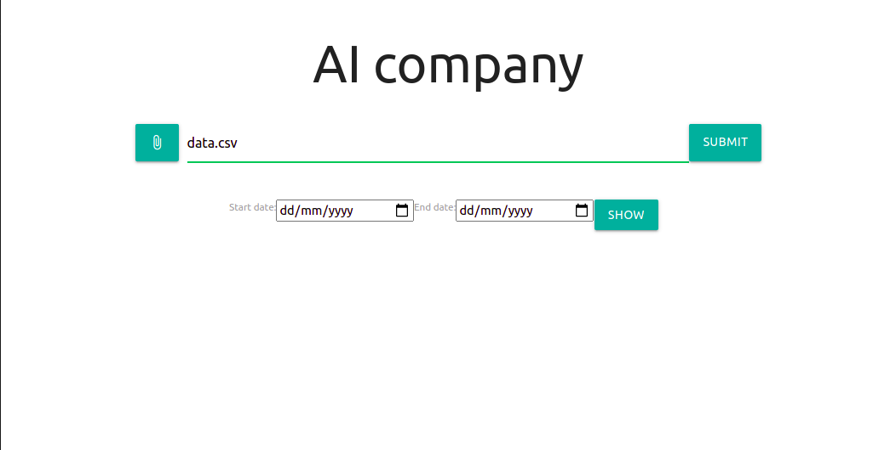
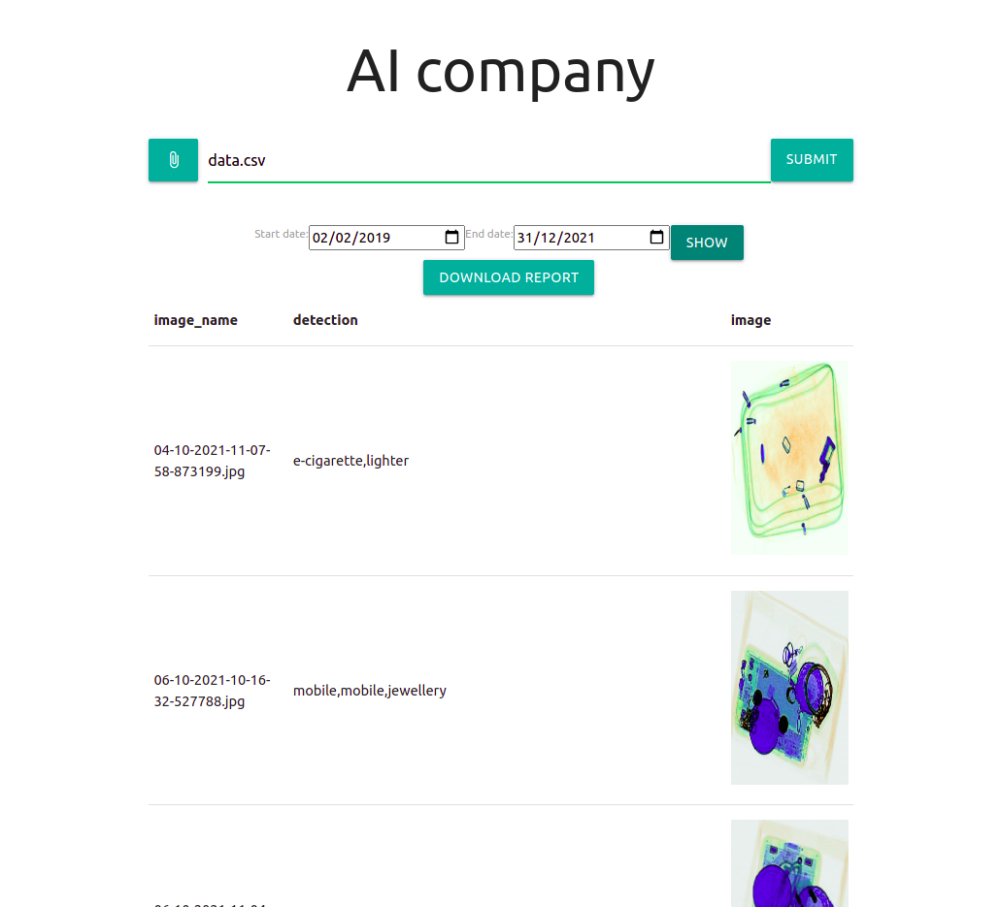

## AI-company

## tested on linux ubuntu Python3

I have used sqllite3 database for storing data Django-rest for server side and react for front-end

## api documentations
[Api documentation link](https://documenter.getpostman.com/view/5938078/UVJZpJwa)

# docker installed
## docker 
`docker-compose up --build` 
## App running on 
http://localhost:3000/

# docker not installed
## backend
`cd backend` 
`python3 -m venv venv` 
`source venv/bin/activate` 
`pip install -r requirements.txt` 
`python manage.py makemigrations` 
`python manage.py migrate` 
`python manage.py runserver` 
`server running on http://localhost:8000/`
#### or copy paste this 
`cd backend \` 
`&& python3 -m venv venv \` 
`&& source venv/bin/activate \` 
`&& pip install -r requirements.txt \` 
`&& python manage.py makemigrations \` 
`&& python manage.py migrate \` 
`&& python manage.py runserver \ ` 

#### server running on http://localhost:8000/

## Run the React app
`cd backend/client/ \` 
`&& npm install -g serve \` 
`&& npm run prod`

## App running on 
http://localhost:3000/

# Website
#### Index page to upload file 

#### Filter data by dates and report creation

